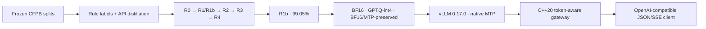

# frontier-forge

> Know your frontier. Then forge past it.

`frontier-forge` post-trains a 4B base model for machine-verifiable CFPB complaint
triage, serves it with vLLM, and puts a C++20 token-aware gateway in front of it.
The release is built around frozen splits, paired confidence intervals, measured
cost, and retained negative results—not a best-checkpoint victory lap.

## Headline

**The release model is R1b, the rule-label scaling ablation—not GRPO.** Scaling
free rule labels from 1,450 to 20,000 raised frozen-eval task success from **66.35%
to 99.05%** (**+32.70 percentage points**, paired 95% CI **[30.60, 34.50]**, n=2,000)
for **15.236 measured RTX 4090 GPU-hours ($4.571)**. R1b's own 95% bootstrap CI is
**[98.60%, 99.45%]**.

The task is strict JSON: normalized product/issue/company fields, urgency,
ambiguity, and exactly one tool call. Headline success is a hard AND over the
decision fields—urgency, ambiguity, tool choice, and structural tool arguments.
Secondary copied metadata is reported separately and does not earn success or RL
reward.

| Rung | Question answered | Task success [95% CI] | Measured GPU h / USD | Verdict |
|---|---|---:|---:|---|
| R0 base | Can the pretrained base follow the contract? | 0.00% [0.00, 0.00] | 0.983 / $0.295 | schema-invalid baseline |
| R1 rule SFT, 1,450 rows | Are scarce free labels enough? | 66.35% [64.20, 68.40] | 3.479 / $1.044 | strong first jump |
| **R1b rule SFT, 20,000 rows** | Does free-label scale win? | **99.05% [98.60, 99.45]** | **15.236 / $4.571** | **release selected** |
| R2 distilled SFT | Does teacher phrasing help this rule-defined task? | 52.15% [50.00, 54.40] | 3.606 / $1.082 | **−14.20 pp vs R1** |
| R3 DPO | Can preferences recover the loss? | 55.95% [53.75, 58.25] | 1.925 / $0.578 | +3.80 pp vs R2 |
| R4 v2 GRPO | Does fresh-pool RL improve R3? | 56.20% on seeds 0/1 | 1.859 / $0.558 (s0) | no aggregate; seed 2 guard-aborted |

All task-success intervals use 1,000 fixed-seed bootstrap resamples. The exact
records live in [`results/runs.jsonl`](results/runs.jsonl); paired deltas live in
[`results/phase3_paired_deltas.json`](results/phase3_paired_deltas.json).

## What shipped



- A QLoRA-trained R1b adapter merged to BF16; a separate GPTQ-int4 deployment
  export; and a sibling BF16 export that restores the fixed base checkpoint's 15
  native `mtp.*` tensors byte-for-byte.
- A workload-controlled vLLM benchmark with client/server timing, verifier-based
  cost per 1,000 successful tasks, native-MTP win/lose boundary, and structured
  output experiments.
- A C++20 Boost.Asio/Beast gateway with token-aware admission, bounded queue,
  deadline/cancellation handling, SSE passthrough, rate limit, circuit breaker,
  fallback policy, and Prometheus metrics.
- An offline evidence explorer in [`demo/`](demo/) and a hash-gated claim replay.
- A cascade handoff landed in [triage-router PR #1](https://github.com/LucisZhang/triage-router/pull/1).
  Its committed CAL grid selects τ=0.8483569229 and models $254.68/1k only under
  a cross-task 5% terminal-failure assumption. Because R1b's structured-action
  input includes source metadata and no joint per-row CAL predictions exist, this
  is explicitly a scenario—not a new certified classification claim—and the
  sister lab's A→B2 headline remains unchanged.

## Serving boundary

Matched RTX 4090 points below use 4 QPS Poisson arrivals, 20 measured requests,
vLLM 0.17.0, client wall-clock streaming latency, and a $0.30/GPU-hour rate.

| R1b deployment | E2E p50 / p95 | Output tok/s | Verifier success | Peak VRAM | Cost / 1k successful tasks |
|---|---:|---:|---:|---:|---:|
| BF16 | 1.424 / 1.690 s | 307.0 | 95% | 22,829 MiB | $0.0211 |
| GPTQ-int4 | 0.809 / 0.963 s | 335.6 | 95% | 22,591 MiB | $0.0193 |
| BF16 + native MTP | **1.063 / 1.311 s** | **320.6** | 95% | 21,587 MiB | $0.0202 |

Native MTP was not an unconditional checkbox win: it lost at 0.25 QPS and won at
0.50, 1, 2, and 4 QPS, with 95.6–96.4% draft-token acceptance. The external 0.5B
draft failed vocabulary compatibility; the compatible 0.8B draft then failed the
Qwen3.5 M-RoPE path. Those attempts remain archived. The final route restored the
base model's own MTP tensors instead of maintaining a private vLLM fork.

The structured-output result was similarly mixed. xGrammar and Outlines both kept
a 100% tool-call rate, so the hypothesized tool-call suppression did **not**
reproduce. Yet simultaneous tool choice + response schema scored 0% task success.
A two-pass design restored 100% for both backends, adding 0.811 s p50 (xGrammar)
or 0.880 s (Outlines).

Full disclosure and raw pointers: [Phase 4 report](results/phase4_serving_report.md).

## Production story: the gateway result has a red flag

On five stable direct/gateway cells, median E2E overhead was **p50 0.3% / p95
0.5%**, with median throughput delta **−0.9%**. That is the valid low-load result.
The overload result is not a win:

| Offered load | Bare vLLM errors | Gateway errors | Gateway queue max | What actually returned |
|---:|---:|---:|---:|---|
| 2× capacity / 4 QPS | 0.0% | 13.3% | 0 | HTTP 502 / `upstream_error` |
| 3× capacity / 6 QPS | 0.0% | 11.7% | 1 | HTTP 502 / `upstream_error` |
| 5× capacity / 10 QPS | 0.0% | 23.3% | 10 | HTTP 502 / `upstream_error` |

Every overload error **passed admission as `primary`**; every cell recorded
`reject_overload=0`. These were not the designed 429 fast rejects. In the
concurrency/length matrix, non-stable gateway cells had **10–85% errors** while
their paired bare-vLLM cells had **0%**. Some gateway success-only p95 values are
therefore lower because failed work disappeared from the survivor set. They are
not unconditional tail-latency wins.

The measured build retains a connection-handling defect under load. The bounded
queue and local failure-injection tests are real; remote evidence for the designed
overload rejection semantics is not. Production use is blocked until that defect
is fixed and the same matched remote matrix is rerun. See the
[Phase 5 report](results/phase5_gateway_report.md) and [gateway design](gateway/README.md).

## Reproduce the headline

The release claim chain makes no GPU or API call:

```bash
uv sync --locked
make reproduce-headline
make demo-build
```

`make reproduce-headline` re-derives the ladder, serving, structured-output,
gateway, export, demo, and cascade-handoff payloads from pinned raw artifacts. It
then verifies the source manifest and every published release file by SHA-256.
`make demo-build` produces `demo/dist/` using only local HTML, CSS, JavaScript, and
the generated receipt—opening the demo does not contact a CDN or model API.

For a fresh-clone CPU smoke of the implementation chain:

```bash
SMOKE=1 make phase6-smoke
```

## Model archives and card

The Phase 6 archive publishes three independently hash-verified variants in one
Hugging Face model repository:

- `bf16/` — merged BF16 tree SHA-256
  `7cf43a2905513f61797b78b7e3fd7ebdacd1cba4fc89abea9ce209401e6e6435`
- `gptq-int4/` — GPTQ-int4 tree SHA-256
  `c99b42cf0e062cc75f2df8588725d0c29383666f3db0c1ae837ce15bfe6d39d2`
- `bf16-mtp-preserved/` — merged BF16 + native-MTP tree SHA-256
  `7878b55f6fe6a9ecb12b9504b1a88d7bc6fef7ba72d91289b6e8d694f6bc75ce`

The repository URL and remote commit are written into the Phase 6 archive receipt
after upload. The complete usage, evaluation, risk, and provenance statement is in
the [Model Card](MODEL_CARD.md).

## Limitations and negative results

- The 99.05% headline is against a deterministic rule policy, not human semantic
  truth. A stratified human review found a 14% wrong-label rate, concentrated in
  escalation/refund false negatives; the rules are also negation-blind.
- Input contract v2 exposes source product/issue/company metadata. That mirrors the
  intended structured-triage setting, but it makes R1b unsuitable as evidence for a
  narrative-only product classifier.
- R2's teacher phrasing lost to free rules in this setting. This does not imply
  distillation is generally useless; it is a boundary case where executable labels
  are cheap and unlimited.
- TRL and Unsloth failed the locked backend-agreement gate; TRL remained the
  reference path.
- R4's original runs were parser-invalid and superseded. R4 v2 seed 2 then hit the
  locked reward-variance guard; no retry, tuning, or three-seed aggregate was made.
- Training-time NF4 QLoRA and deployment-time GPTQ-int4 are different facts.
  Neither is described as the other.
- No safety, fairness, privacy, or human-impact validation supports autonomous
  decisions. CFPB narratives may contain sensitive consumer information.

Execution details: [PLAN.md](PLAN.md). Locked decisions: [DECISIONS.md](DECISIONS.md).
Agent rules: [AGENTS.md](AGENTS.md).
