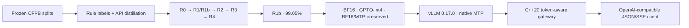

# frontier-forge

> Know your frontier. Then forge past it.

`frontier-forge` post-trains a 4B base model for machine-verifiable CFPB complaint
triage, serves it with vLLM, and puts a C++20 token-aware gateway in front of it.
The release is built around frozen splits, paired confidence intervals, measured
cost, and retained negative results—not a best-checkpoint victory lap.

## Headline

**The release model is R1b, the rule-label scaling ablation—not GRPO.** Scaling
free rule labels from 1,450 to 20,000 raised frozen-eval task success from **66.35%
to 99.05%** (**+32.70 percentage points**, paired 95% CI **[30.60, 34.50]**, n=2,000)
in a **single training seed (seed 0)**, for **15.236 measured RTX 4090 GPU-hours
($4.571)**. R1b's own 95% bootstrap CI is **[98.60%, 99.45%]**.

The task is strict JSON: normalized product/issue/company fields, urgency,
ambiguity, and exactly one tool call. Headline success is a hard AND over the
decision fields—urgency, ambiguity, tool choice, and structural tool arguments.
Secondary copied metadata is reported separately and does not earn success or RL
reward.

| Rung | Question answered | Task success [95% CI] | Measured GPU h / USD | Verdict |
|---|---|---:|---:|---|
| R0 base | Can the pretrained base follow the contract? | 0.00% [0.00, 0.00] | 0.983 / $0.295 | schema-invalid baseline |
| R1 rule SFT, 1,450 rows | Are scarce free labels enough? | 66.35% [64.20, 68.40] | 3.479 / $1.044 | strong first jump |
| **R1b rule SFT, 20,000 rows** | Does free-label scale win? | **99.05% [98.60, 99.45]** | **15.236 / $4.571** | **release selected** |
| R2 distilled SFT | Does teacher phrasing help this rule-defined task? | 52.15% [50.00, 54.40] | 3.606 / $1.082 | **−14.20 pp vs R1** |
| R3 DPO | Can preferences recover the loss? | 55.95% [53.75, 58.25] | 1.925 / $0.578 | +3.80 pp vs R2 |
| R4 v2 GRPO | Does fresh-pool RL improve R3? | 56.20% on seeds 0/1 | 1.859 / $0.558 (s0) | no aggregate; seed 2 guard-aborted |

All task-success intervals use 1,000 fixed-seed bootstrap resamples. The exact
records live in [`results/runs.jsonl`](results/runs.jsonl); paired deltas live in
[`results/phase3_paired_deltas.json`](results/phase3_paired_deltas.json).

The executable rule engine itself scores **100% at $0 model-inference cost** on its
own policy benchmark. R1b's prospective value is generalization beyond exact
literal-rule coverage; this rule-grounded evaluation does not establish that value.

Through Phase 5, `make reproduce-headline` derives a de-duplicated subtotal of
**37.581 RTX 4090 GPU-hours ($11.274) + $13.038 teacher API = $24.313** from the
Phase 1/2 API ledgers, billable Phase 3 rows, Phase 4 operation receipts, and the
Phase 5 ledger. Separately, the three committed Phase 7 A10 receipts in the
[Gate 7.1 ledger](results/phase7_1/gpu_ledger.jsonl) and
[Gate 7.2 ledger](results/phase7_2/gpu_ledger.jsonl)—including the failed Gate 7.1
attempt—record **7.430 A10 GPU-hours ($11.369 at $1.53/hour)**: 3.349 hours for
the failed gate, 0.614 hours for the sustained amendment, and 3.467 hours for
Phase 7.2. RTX 4090 and A10 hours remain separate; adding the Phase 1–5 subtotal
and Phase 7 A10 receipt dollars, without combining hardware hours, gives
**$35.681 recorded project spend through Phase 7.2**. This is a recorded-operation
total, not an estimate of unmetered idle time or a cloud-provider invoice.

## What shipped



- A QLoRA-trained R1b adapter merged to BF16; a separate GPTQ-int4 deployment
  export; and a sibling BF16 export that restores the fixed base checkpoint's 15
  native `mtp.*` tensors byte-for-byte.
- A workload-controlled vLLM benchmark with client/server timing, verifier-based
  cost per 1,000 successful tasks, native-MTP win/lose boundary, and structured
  output experiments.
- A C++20 Boost.Asio/Beast gateway with token-aware admission, bounded queue,
  deadline/cancellation handling, SSE passthrough, rate limit, circuit breaker,
  fallback policy, and Prometheus metrics.
- An offline evidence explorer in [`demo/`](demo/) and a hash-gated claim replay.
- A cascade handoff landed in [triage-router PR #1](https://github.com/LucisZhang/triage-router/pull/1).
  Its committed CAL grid selects τ=0.8484 and models $254.68/1k only under
  a cross-task 5% terminal-failure assumption. Because R1b's structured-action
  input includes source metadata and no joint per-row CAL predictions exist, this
  is explicitly a scenario—not a new certified classification claim—and the
  sister lab's A→B2 headline remains unchanged.

## Serving boundary

Matched RTX 4090 points below use 4 QPS Poisson arrivals, 20 measured requests,
vLLM 0.17.0, client wall-clock streaming latency, and a $0.30/GPU-hour rate.

| R1b deployment | E2E p50 / p95 | Output tok/s | Verifier success | Peak VRAM | Cost / 1k successful tasks |
|---|---:|---:|---:|---:|---:|
| BF16 | 1.424 / 1.690 s | 307.0 | 95% | 22,829 MiB | $0.0211 |
| GPTQ-int4 | 0.809 / 0.963 s | 335.6 | 95% | 22,591 MiB | $0.0193 |
| BF16 + native MTP | **1.063 / 1.311 s** | **320.6** | 95% | 21,587 MiB | $0.0202 |

Each 95% entry is only 19/20 requests; its 95% Wilson interval is **[76.4%,
99.1%]**. The n=20 serving success rates are therefore fragile boundary
measurements, not precise deployment-reliability estimates.

Native MTP was not an unconditional checkbox win: it lost at 0.25 QPS and won at
0.50, 1, 2, and 4 QPS, with 95.6–96.4% draft-token acceptance. The external 0.5B
draft failed vocabulary compatibility; the compatible 0.8B draft then failed the
Qwen3.5 M-RoPE path. Those attempts remain archived. The final route restored the
base model's own MTP tensors instead of maintaining a private vLLM fork.

The structured-output result was similarly mixed. xGrammar and Outlines both kept
a 100% tool-call rate, so the hypothesized tool-call suppression did **not**
reproduce. Yet simultaneous tool choice + response schema scored 0% task success.
A two-pass design restored 100% for both backends, adding 0.811 s p50 (xGrammar)
or 0.880 s (Outlines).

Full disclosure and raw pointers: [Phase 4 report](results/phase4_serving_report.md).

## Production story: sustained overload resolves the gateway red flag

The original Phase 5 RTX 4090 result remains an important negative finding: admitted requests returned HTTP 502/`upstream_error`, `reject_overload=0`, and non-stable gateway cells reached 10–85% errors while paired bare vLLM had 0%. Lower success-only latency in those cells was survivor-biased. The original [Phase 5 receipt](results/phase5/raw/phase5_gateway_bench.json) and [report](results/phase5_gateway_report.md) remain unchanged.

The first same-box A10 rerun fixed the connection-reuse failure: all nine matched matrix cells and all finite overload cells had 0 upstream 5xx. Its 60-request bursts reached queue high-watermarks 8/20/24 at 2×/3×/5×; 2× and 3× fit inside the 24-request queue, while 5× shed 14 requests as HTTP 429. The earlier “one 429 in every finite cell” check was therefore a miscalibrated proxy, not evidence that bounded admission failed. That [finite A10 receipt](results/phase7_1/raw/phase7_1_gateway_bench.json) remains preserved.

The human-approved amendment replaced that proxy with fixed-seed Poisson arrivals lasting at least 120 seconds per 2×/3×/5× cell, gateway versus same-box bare vLLM:

| load | arrival windows bare/gateway | requests bare/gateway | bare 5xx / transport | gateway 5xx / 429 | queue sampled/process | 429 p95 |
|---:|---:|---:|---:|---:|---:|---:|
| 2× | 120.1s / 120.1s | 510 / 510 | 0 (0.0%) / 0 | 0 (0.0%) / 19 | 24/24 | 1.5 ms |
| 3× | 120.4s / 120.4s | 707 / 707 | 0 (0.0%) / 0 | 0 (0.0%) / 215 | 24/24 | 2.1 ms |
| 5× | 120.1s / 120.1s | 1177 / 1177 | 36 (3.1%) / 651 | 0 (0.0%) / 687 | 24/24 | 1.9 ms |

The bare-vLLM 5× cell is retained as a negative result: vLLM 0.17.0 terminated its EngineCore on a GDN+MTP decode assertion after 490×200 and 36×500, leaving 651 transport errors. The matched gateway 5× cell kept the upstream alive and returned 490×200 plus 687 bounded 429 rejects. This transport failure is disclosed in addition to, not substituted for, the predeclared HTTP-5xx parity gate. That ±5.0 pp parity calculation uses every scheduled non-429 request as its denominator, so the 651 bare transport errors remain in the denominator but are not counted as bare HTTP-5xx failures; the gateway surviving this one observed EngineCore crash is not a demonstrated protection guarantee.

Every sustained gateway cell sampled the queue at its configured bound, and excess requests surfaced as fast HTTP 429/`overloaded` responses with `Retry-After`; admitted upstream 5xx remained within the predeclared ±5.0 pp band of paired bare vLLM. The Phase 5 production block is therefore lifted for this measured **single-node gateway overload contract only**. This is not evidence of cloud production, multi-GPU scaling, or Phase 7.2 Kubernetes readiness. See the [amended Gate 7.1 report](results/phase7_1_sustained_a10_report.md) and [raw sustained receipt](results/phase7_1/raw/phase7_1_sustained_gateway_bench.json).

## Phase 7.2: single-node k3s runtime

The serving stack was then rehearsed on one real systemd VM with one physical
NVIDIA A10 (23,028 MiB), k3s v1.36.3+k3s1, the NVIDIA device plugin, Prometheus,
Grafana, Prometheus Adapter, and KEDA. The device plugin exposed exactly two
time-sliced `nvidia.com/gpu.shared` allocations; this is still **one GPU**, not
multi-GPU or cloud-production evidence. Kafka remains out of scope.

The `forge-system` namespace retained Pod Security `baseline`. Two
administrator-owned Local PersistentVolumes, pinned to the labeled model-store
node, exposed the independently hashed model trees through read-only PVC mounts.
All 23 cluster Services were `ClusterIP`; the gateway, Prometheus, Pushgateway,
and Grafana operator paths listened only on `127.0.0.1` and were reached through
SSH. No security-group, `NodePort`, `LoadBalancer`, `hostPort`, or host-network
exposure was added. The [inventory receipt](results/phase7_2/raw/inventory.json)
records these checks, image identities, chart releases, targets, rules, model
hashes, and dashboard discovery.

| Gate 7.2 measurement | Result |
|---|---:|
| Gateway custom-metric scale | 1 → 3 → 1 Ready replicas |
| Saturation queue / HTTP 429 | 24/24; 3,799 rejects |
| 429 with `Retry-After` | 3,799 / 3,799 |
| GPU scale-from-zero samples | n=10; 10 unique Pod UIDs; 10/10 task-verified |
| Cold start min / p50 / p95 / max | 116.539 / 124.617 / 127.112 / 128.050 s |
| int4 + BF16 coexistence | 8,122 + 12,824 MiB on the one A10 |
| Measured route stages | 45/5, 20/20, 0/20 int4/BF16; 110/110 HTTP 200 |
| Availability fault | `ForgeAvailabilityBurnRate` firing |
| Latency fault | `ForgeLatencyBurnRate` firing; 573 slow HTTP 200 responses |
| Kill-vLLM recovery | fail-closed 503; new Pod UID; 120.708 s to verified recovery |

Only the CPU gateway replicas demonstrated multi-replica KEDA scaling
(1→3→1). Each GPU deployment scaled only between 0 and 1 replica; no GPU replica
count above 1 was exercised. The approximately 125-second cold-start p50 targets
batch and development workloads, not an interactive serving SLO.

The canary attribution probes were deliberately sequential: they prove measured
10%→50%→100% routing while both models coexist on one time-sliced physical GPU;
the separate 120-second k6 scenario owns concurrent saturation evidence. After
100% BF16 promotion, an injected HTTP-500 backend fired the availability alert;
the router rolled back to GPTQ-int4 and recovered a task-verified response. A
separate three-second backend fired the p95 latency alert while predominantly
returning HTTP 200, then also recovered to a verified stable response.

Negative bring-up results remain committed rather than hidden: direct Pod
`hostPath` was rejected by Pod Security and replaced by Local PV/PVCs; a missing
`--language-model-only` flag caused an unmeasured multimodal profiling peak; the
first concurrent canary attribution run exposed one-GPU contention; and the first
two latency-alert attempts found a noncanonical histogram label and an
underpowered fault rate. Their five `preflight_*_failure.json` receipts sit beside
the successful raw artifacts. The three scripted runbook drills, k6 receipts,
dashboard JSON, and CPU-only kind CI smoke are reproducible from
[`deploy/phase7_2/`](deploy/phase7_2/) and
[`docs/runbooks/phase7_2.md`](docs/runbooks/phase7_2.md). See the final
[Phase 7.2 report](results/phase7_2_k3s_report.md) and
[acceptance receipt](results/phase7_2/raw/phase7_2_acceptance.json).

## Reproduce the headline

The release claim chain makes no GPU or API call:

```bash
uv sync --locked
make reproduce-headline
make demo-build
```

`make reproduce-headline` re-derives the ladder, serving, structured-output,
gateway, export, demo, and cascade-handoff payloads from pinned raw artifacts. It
then verifies the source manifest and every published release file by SHA-256.
`make demo-build` produces `demo/dist/` using only local HTML, CSS, JavaScript, and
the generated receipt—opening the demo does not contact a CDN or model API.

For a fresh-clone CPU smoke of the implementation chain:

```bash
SMOKE=1 make phase6-smoke
```

The target writes mutable Phase 3 and Phase 4 smoke artifacts only under the
ignored `.tmp-phase6-smoke/` tree, so the advertised command leaves tracked smoke
fixtures unchanged.

## Model archives and card

The Phase 6 archive publishes three independently hash-verified variants in one
Hugging Face model repository:

- `bf16/` — merged BF16 tree SHA-256
  `7cf43a2905513f61797b78b7e3fd7ebdacd1cba4fc89abea9ce209401e6e6435`
- `gptq-int4/` — GPTQ-int4 tree SHA-256
  `c99b42cf0e062cc75f2df8588725d0c29383666f3db0c1ae837ce15bfe6d39d2`
- `bf16-mtp-preserved/` — merged BF16 + native-MTP tree SHA-256
  `7878b55f6fe6a9ecb12b9504b1a88d7bc6fef7ba72d91289b6e8d694f6bc75ce`

The public archive is [`Luciss007/frontier-forge-r1b`](https://huggingface.co/Luciss007/frontier-forge-r1b).
Its manifest-bound artifacts are fixed at commit
[`fd4ae1e`](https://huggingface.co/Luciss007/frontier-forge-r1b/tree/fd4ae1e1989dcb1641a496bf796031491518983e);
the independently downloadable public receipt is fixed at commit
[`a717e9c`](https://huggingface.co/Luciss007/frontier-forge-r1b/blob/a717e9c50435fc81b795d5683a22d0efe8191d16/provenance/archive_receipt.json).
The local [archive receipt](results/phase6/hf_archive_receipt.json) records exact
path sets and per-file LFS SHA-256 or Git-blob verification. The
[remote-disk audit](results/phase6/remote_disk_audit.json) reports no remaining
remote-only asset within the explicitly bounded project durable-asset scope;
unrelated shared-pod files, caches, dependencies, and rebuildable temporary paths
are not part of that claim. The complete usage, evaluation, risk, and provenance
statement is in the [Model Card](MODEL_CARD.md).

## Limitations and negative results

- The 99.05% headline is against a deterministic rule policy, not human semantic
  truth. A deliberately enriched 50-row strong-action stratified review found
  7/50 wrong labels (14.0%), all escalation/refund false negatives. That sample
  balanced changed action transitions, so 14.0% is neither a population error-rate
  estimate nor comparable to the earlier v2 4% audit; the rules are also
  negation-blind. See the [audit qualification](results/phase1_2_label_audit.md#final-stratified-review-result).
- Input contract v2 exposes source product/issue/company metadata. That mirrors the
  intended structured-triage setting, but it makes R1b unsuitable as evidence for a
  narrative-only product classifier.
- R2's teacher phrasing lost to free rules in this setting. This does not imply
  distillation is generally useless; it is a boundary case where executable labels
  are cheap and unlimited.
- TRL and Unsloth failed the locked backend-agreement gate; TRL remained the
  reference path.
- R4's original runs were parser-invalid and superseded. R4 v2 seed 2 then hit the
  locked reward-variance guard; no retry, tuning, or three-seed aggregate was made.
- Training-time NF4 QLoRA and deployment-time GPTQ-int4 are different facts.
  Neither is described as the other.
- No safety, fairness, privacy, or human-impact validation supports autonomous
  decisions. CFPB narratives may contain sensitive consumer information.

Engineering decisions and phase logs live in [docs/engineering-log/](docs/engineering-log/).
> 工程决策与阶段日志在 docs/engineering-log/。

Execution details: [PLAN.md](docs/engineering-log/PLAN.md). Locked decisions: [DECISIONS.md](docs/engineering-log/DECISIONS.md).
Agent rules: [AGENTS.md](AGENTS.md).

## License

Source code is licensed under [Apache-2.0](LICENSE). Released model variants follow
the Apache-2.0 license declared by the fixed Qwen3.5-4B-Base checkpoint; the code
license does not relicense the CFPB source records. See the [Model Card](MODEL_CARD.md)
for the base-model inheritance and public-data provenance statement.
