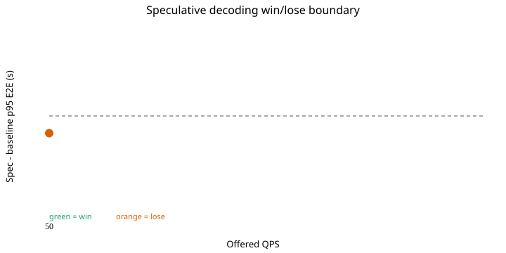

# Phase 4 serving and inference engineering report

## Disclosure

- Mode: SMOKE (non-headline).
- Hardware: mock CPU; driver n/a; device memory n/a MiB.
- CPU co-tenancy: the pod was shared with an unrelated CPU-only task; host has 10 logical cores. Every new spec-decode and structured sweep sampled load average and CPU utilization; any load1 sample above half the core count contaminated and reran the entire sweep. Contaminated attempts remain linked from the raw receipt.
- Historical serving sweeps completed before the CPU co-tenancy sampling requirement and are identified as such; matched spec baseline/native-MTP and both structured backends use the new clean-sweep gate.
- Serving variants and precision: r1b / bfloat16, r1b / gptq_int4, r3_equivalent_legacy_r4_zero_update / bfloat16, r3_equivalent_legacy_r4_zero_update / gptq_int4.
- vLLM version: 0.17.0.
- Workload source: frozen `mixed` evaluation rows; workload SHA-256 `852c9f7f1de6ebed7037ba4dae862364dadcafd296ee4fa5f7e3d19e2821cbbd`.
- Input lengths: targets [800, 1400, 2000] with weights [0.4, 0.4, 0.2]; measurement = UTF-8 byte-length divided by four (SMOKE_ONLY).
- Output controls: max-token caps [192, 256] with weights [0.5, 0.5].
- Arrival process: Poisson, fixed seed 20260818; offered sweep [0.25, 0.5, 1.0, 2.0, 4.0] QPS; concurrency cap 32.
- Warm-up: 6 requests excluded; measurement: 20 requests per QPS point.
- Timing sides: client = monotonic wall clock around streamed OpenAI HTTP request; server = delta of vLLM Prometheus histograms over each measurement point.
- Verifier: `forge.verify.verifier.score`; input normalization = forge.train.grpo._completion_text: keep the suffix after the final </think>, then strip; request artifacts preserve both raw and normalized outputs.
- Stable means all declared error-rate, deadline-miss, achieved-QPS, and p95-inflation checks pass; max stable concurrency is the largest observed in-flight count among such points.
- Cost per 1k successful tasks uses verifier-passing requests in the denominator, never token count.
- Superseded measurement retained: `phase4_serve_r1b_bf16` at `results/phase4/raw/phase4_serve_r1b_bf16.json`; reason: The original harness passed the raw </think>-prefixed completion directly to the verifier instead of applying the locked Phase 3 completion normalization.
- Superseded measurement retained: `phase4_spec_decode_r1b_bf16_baseline` at `results/phase4/raw/phase4_spec_decode_r1b_bf16_baseline.json`; reason: matched baseline rerun on the MTP-preserving target with CPU co-tenancy sampling

## Serving sweep

Client timings are wall-clock observations around the streamed HTTP request. ITL is the per-request mean `(E2E - TTFT) / (completion_tokens - 1)`. The server-side table below is independently derived from vLLM Prometheus histograms.

| Variant | Precision | QPS | TTFT p50 s | ITL p50 s | E2E p50 s | E2E p95 s | tok/s | req/s | Success | VRAM peak MiB | Cost / 1k success | Stable |
|---|---|---:|---:|---:|---:|---:|---:|---:|---:|---:|---:|---|
| r1b | bfloat16 | 50.000 | 0.0012 | 0.0003 | 0.0188 | 0.0262 | 2928.93 | 38.79 | 100.0% | n/a | $0.0021 | no |
| r1b | gptq_int4 | 50.000 | 0.0013 | 0.0003 | 0.0204 | 0.0258 | 2962.98 | 39.24 | 100.0% | n/a | $0.0021 | no |
| r3_equivalent_legacy_r4_zero_update | bfloat16 | 50.000 | 0.0017 | 0.0003 | 0.0230 | 0.0259 | 2964.05 | 39.26 | 100.0% | n/a | $0.0021 | no |
| r3_equivalent_legacy_r4_zero_update | gptq_int4 | 50.000 | 0.0013 | 0.0003 | 0.0207 | 0.0258 | 2962.99 | 39.24 | 100.0% | n/a | $0.0021 | no |

| Variant | Precision | Max stable observed concurrency | Max stable offered QPS |
|---|---|---:|---:|
| r1b | bfloat16 | none | n/a |
| r1b | gptq_int4 | none | n/a |
| r3_equivalent_legacy_r4_zero_update | bfloat16 | none | n/a |
| r3_equivalent_legacy_r4_zero_update | gptq_int4 | none | n/a |

### Independent server-side timing

The representative point is the highest stable QPS, or the highest tested QPS when no point passes the declared stability criteria.

| Variant | Precision | QPS | Server TTFT p50/p95 s | Server ITL p50/p95 s | Server E2E p50/p95 s |
|---|---|---:|---:|---:|---:|
| r1b | bfloat16 | 50.000 | 0.0050/0.0095 | 0.0050/0.0095 | 0.0050/0.0095 |
| r1b | gptq_int4 | 50.000 | 0.0050/0.0095 | 0.0050/0.0095 | 0.0050/0.0095 |
| r3_equivalent_legacy_r4_zero_update | bfloat16 | 50.000 | 0.0050/0.0095 | 0.0050/0.0095 | 0.0050/0.0095 |
| r3_equivalent_legacy_r4_zero_update | gptq_int4 | 50.000 | 0.0050/0.0095 | 0.0050/0.0095 | 0.0050/0.0095 |

## Speculative decoding boundary

A point is a win only when speculative decoding has no worse client p95 E2E and no lower verifier-successful request throughput than the matched baseline. Boundary: **no win in tested range**.

Method run: **mtp** (`model-native MTP`, 1 draft token). D1.3 selected the model-native path because `smoke_config_only`; the fixed-revision base index contains not evaluated in smoke `mtp.*` weights and the R1b adapter contains none. The sibling R1b export restores those exact base tensor bytes. vLLM stays at `0.17.0` with no M-RoPE patch and no version change.

Prior failed attempts remain archived: not loaded in SMOKE.



| QPS | Baseline p95 s | Spec p95 s | Delta s | Baseline success req/s | Spec success req/s | Acceptance | Mean acceptance length | Load1 max | CPU mean | Clean | Verdict |
|---:|---:|---:|---:|---:|---:|---:|---:|---:|---:|---|---|
| 50.000 | 0.0267 | 0.0265 | -0.0002 | 38.98 | 38.78 | 70.0% | 3.80 | 5.56 | n/a | no | lose |

## Structured-output deep dive

### Backend overhead and cold compile

Cold compile overhead is first request latency minus the median repeated latency for the same previously unseen schema. Steady constraint overhead is repeated constrained median minus an unconstrained control with the same prompt.

| Backend | Required fields | Cold latency s | Steady p50 s | Cold compile overhead s | Steady constraint overhead s |
|---|---:|---:|---:|---:|---:|
| outlines | 2 | 0.0012 | 0.0010 | 0.0003 | 0.0001 |
| outlines | 6 | 0.0009 | 0.0010 | -0.0002 | 0.0001 |
| outlines | 12 | 0.0010 | 0.0011 | -0.0001 | 0.0002 |
| outlines | 24 | 0.0009 | 0.0009 | 0.0000 | 0.0000 |
| xgrammar | 2 | 0.0012 | 0.0009 | 0.0003 | 0.0000 |
| xgrammar | 6 | 0.0009 | 0.0008 | 0.0001 | -0.0000 |
| xgrammar | 12 | 0.0008 | 0.0009 | -0.0001 | 0.0001 |
| xgrammar | 24 | 0.0008 | 0.0008 | -0.0000 | 0.0000 |

### Constraint tax and two-pass mitigation

The one-pass condition sends `tool_choice=required` and a simultaneous response JSON schema. Two-pass first obtains a model-selected tool, then constrains the complete ticket with that selected tool fixed. Missing first-pass choices are not filled from gold labels and count as failures.

| Backend | Tools-only call rate | Simultaneous call rate | Constraint-tax delta | One-pass task success | Two-pass task success | Mitigation delta | One-pass p50 s | Two-pass p50 s | Latency delta s |
|---|---:|---:|---:|---:|---:|---:|---:|---:|---:|
| outlines | 100.0% | 0.0% | -100.0% | 100.0% | 100.0% | 0.0% | 0.0009 | 0.0018 | 0.0009 |
| xgrammar | 100.0% | 0.0% | -100.0% | 100.0% | 100.0% | 0.0% | 0.0009 | 0.0016 | 0.0007 |

### CPU co-tenancy measurements

| Backend | Logical cores | Load1 threshold | Load1 mean/max | CPU mean/max | Samples | Clean | Contaminated attempts retained |
|---|---:|---:|---:|---:|---:|---|---:|
| outlines | 10 | 5.00 | 5.56/5.56 | n/a/n/a | 2 | no | 0 |
| xgrammar | 10 | 5.00 | 5.56/5.56 | n/a/n/a | 2 | no | 0 |

## Phase 4 gate

- [x] Disclosure block includes hardware, precision, load distribution, arrival rate, warm-up, and timing side.
- [ ] New latency-sensitive sweeps record CPU/load co-tenancy and final headline attempts are below the contamination threshold.
- [x] Cost per 1k successful tasks is computed against verifier-passing requests.
- [x] Speculative-decoding acceptance rate is recorded at every QPS point.
- [x] Speculative-decoding win/lose boundary is tabulated and plotted.
- [x] Constraint-tax tool-call rates and two-pass task-success/latency deltas are reported.
- [x] Report and SVG are deterministic functions of hash-checked raw artifacts.

## Reproduction

```bash
make bench-report
```

Raw provenance:

- `phase4_serve_r1b_bf16_v2`: `data/smoke/phase4/raw/phase4_serve_r1b_bf16_v2.json`; config `configs/phase4/serve_r1b_bf16.yaml`; Git `253e7cca3c377adc771017363e2d074a02d77f7a`.
- `phase4_serve_r1b_gptq_int4`: `data/smoke/phase4/raw/phase4_serve_r1b_gptq_int4.json`; config `configs/phase4/serve_r1b_gptq_int4.yaml`; Git `253e7cca3c377adc771017363e2d074a02d77f7a`.
- `phase4_serve_r3eq_bf16`: `data/smoke/phase4/raw/phase4_serve_r3eq_bf16.json`; config `configs/phase4/serve_r3eq_bf16.yaml`; Git `253e7cca3c377adc771017363e2d074a02d77f7a`.
- `phase4_serve_r3eq_gptq_int4`: `data/smoke/phase4/raw/phase4_serve_r3eq_gptq_int4.json`; config `configs/phase4/serve_r3eq_gptq_int4.yaml`; Git `253e7cca3c377adc771017363e2d074a02d77f7a`.
- `phase4_spec_decode_r1b_bf16_baseline_v2`: `data/smoke/phase4/raw/phase4_spec_decode_r1b_bf16_baseline_v2.json`; config `configs/phase4/spec_r1b_bf16_baseline.yaml`; Git `253e7cca3c377adc771017363e2d074a02d77f7a`.
- `phase4_spec_decode_r1b_bf16_native_mtp`: `data/smoke/phase4/raw/phase4_spec_decode_r1b_bf16_native_mtp.json`; config `configs/phase4/spec_r1b_bf16_mtp.yaml`; Git `253e7cca3c377adc771017363e2d074a02d77f7a`.
- `phase4_structured_r1b_bf16_outlines`: `data/smoke/phase4/raw/phase4_structured_r1b_bf16_outlines.json`; config `configs/phase4/structured_r1b_bf16_outlines.yaml`; Git `253e7cca3c377adc771017363e2d074a02d77f7a`.
- `phase4_structured_r1b_bf16_xgrammar`: `data/smoke/phase4/raw/phase4_structured_r1b_bf16_xgrammar.json`; config `configs/phase4/structured_r1b_bf16_xgrammar.yaml`; Git `253e7cca3c377adc771017363e2d074a02d77f7a`.
