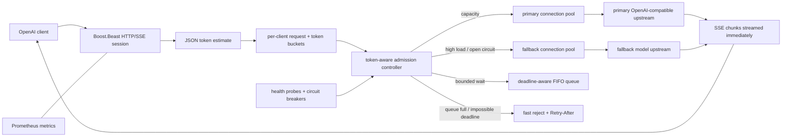

# frontier-forge LLM-aware gateway

This directory contains the Phase 5 C++20 gateway specified by D7. It is an
admission-control layer for OpenAI-compatible LLM servers, not a general reverse
proxy. The local implementation and safety tests are complete; the colocated
vLLM benchmark and any measured resume claim are intentionally deferred to the
separately authorized remote-benchmark session.

## Architecture



The policy layer (`admission`, `rate_limiter`, `circuit_breaker`, and
`token_estimator`) has no sockets and is deterministic under an injected steady
clock. The network layer uses Boost.Asio C++20 coroutines and Boost.Beast for HTTP
parsing/serialization. This separation keeps overload semantics unit-testable.

## Admission policy

The estimated work for one request is:

```
estimated_tokens = estimated_prompt_tokens + requested_max_output_tokens
```

Prompt estimation counts UTF-8 code points in `messages`, `prompt`, `input`, and
`tools`, adds chat framing overhead, and uses a conservative characters-per-token
heuristic. `max_completion_tokens` takes precedence over `max_tokens`; missing or
extreme values are defaulted/clamped. This is intentionally not a tokenizer, in
line with D7's non-goals.

For every request, the controller applies this order:

| Condition | Decision | HTTP behavior |
|---|---|---|
| per-client request or token bucket empty | rate reject | `429` + `Retry-After` |
| estimate cannot fit any eligible route | oversize reject | `413` |
| primary below the configured token-utilization threshold | primary lease | proxy to primary |
| primary loaded/unavailable and a healthy fallback fits | degrade route | rewrite `model`, proxy to fallback |
| primary busy, queue has request/token room, and predicted wait fits deadline | enqueue | asynchronous FIFO wait |
| queue bound reached | overload reject | `503` + `Retry-After` |
| predicted wait leaves no execution budget | deadline reject | `504` |
| every route unhealthy or circuit-open | unavailable reject | `503` + `Retry-After` |

Active and queued work are charged by estimated tokens, not request count. Queue
bounds exist independently for requests and tokens. A high-watermark is retained
for tests and metrics, so overload cannot silently become unbounded memory growth.
The service-time estimate is an EWMA updated when leases complete and drives
deadline feasibility and `Retry-After`.

## Async I/O, deadlines, and cancellation

- Each accepted connection runs in a Boost.Asio coroutine.
- Primary and fallback routes each have a bounded keep-alive connection pool.
- Upstream response bodies are parsed by Beast and relayed as HTTP chunks as soon
  as bytes arrive; `text/event-stream` is therefore not buffered to completion.
- `X-Request-Timeout-Ms` is clamped to the configured maximum and propagated to
  the upstream as the remaining budget. Connect, write, header-read, body-read,
  and downstream-write operations share that absolute deadline.
- A concurrent downstream-read watcher detects FIN/reset. It cancels the queued
  ticket or closes the leased upstream connection, then releases the token lease.
- Transport errors and upstream 5xx responses feed a per-route circuit breaker.
  A single half-open probe is permitted after the recovery interval.
- `/health` probes update route availability independently of the breaker.

The current server accepts one request per downstream TCP connection and talks
plain HTTP to colocated/local upstreams. Production TLS termination, authentication,
and identity-to-`X-Client-ID` binding belong outside this component.

## Endpoints and observability

- `POST /v1/*`: OpenAI-compatible JSON passthrough.
- `GET /healthz` and `/readyz`: primary-upstream readiness.
- `GET /metrics`: Prometheus text format.

Metric families include queue depth/tokens/high-watermark, active requests/tokens
by route, routing decisions, response status classes, upstream failures, replica
health, circuit state, and an end-to-end request-latency histogram. Responses also
carry `X-Forge-Route: primary|fallback` for traceability.

## Build and local verification

macOS requires CMake, Clang, Boost JSON/System, and GoogleTest (the build fetches
GoogleTest only when no package is installed):

```sh
brew install boost llama.cpp
make gateway-test
```

`make gateway-test` configures the `sanitize` preset and runs every GoogleTest
under ASan + UBSan. The suite includes deterministic policy tests, concurrent
admission stress, OpenAI JSON passthrough, keep-alive pool reuse, SSE timing,
fallback model rewriting, rate limits, health transitions, queue saturation,
deadline expiry, downstream cancellation, injected 5xx, and upstream disconnects.

The mock can also be run independently:

```sh
gateway/build/sanitize/tests/mock_upstream --port 18080
gateway/build/sanitize/forge_gateway \
  --primary-port 18080 \
  --fallback-port 18081 \
  --fallback-model fallback-model
```

Mock failure controls are request headers:

- `X-Mock-Latency-Ms: N`
- `X-Mock-Status: 500`
- `X-Mock-Disconnect: before_headers|mid_body`

Linux ThreadSanitizer runs in a clean Ubuntu container:

```sh
make gateway-tsan
```

### Real llama.cpp upstream

The integration script defaults to the official
[`Qwen/Qwen3-4B-GGUF:Q4_K_M`](https://huggingface.co/Qwen/Qwen3-4B-GGUF)
(4B, Q4_K_M) and exercises non-streaming completion, SSE, and metrics:

```sh
make gateway-llama-test
```

Set `LLAMA_MODEL=/absolute/path/model.gguf` to avoid a Hugging Face download, or
override `LLAMA_HF_REPO`, `LLAMA_MODEL_ID`, `LLAMA_SERVER_BIN`, and the two ports.
The script starts and stops both local processes and leaves model-cache ownership
to llama.cpp.

Run `forge_gateway --help` for every configuration flag. A minimal production-like
launch is:

```sh
forge_gateway \
  --listen-port 9000 \
  --primary-host 127.0.0.1 --primary-port 8000 \
  --fallback-host 127.0.0.1 --fallback-port 8001 \
  --fallback-model qwen-fallback \
  --primary-token-capacity 65536 \
  --fallback-token-capacity 32768 \
  --max-queue-requests 64 --max-queue-tokens 131072
```

## Remote benchmark contract (not run in this local phase)

The later remote session must colocate the gateway with the same vLLM server and
run direct-vs-gateway cells across concurrency and prompt/output-length
distributions. Each cell must use identical requests, arrival process, warm-up,
measurement window, model artifact, precision, and hardware. Report D8 metrics:
TTFT, inter-token latency, p50/p95 end-to-end latency, tokens/s, requests/s, max
stable concurrency, VRAM, and cost per 1,000 successful tasks.

The overload experiment must drive 2x, 3x, and 5x measured capacity and compare
tail latency, error semantics, queue high-watermark, fallback share, fast-reject
latency, and recovery time. Profile the gateway in that environment, optimize the
largest measured gateway-side cost, and publish before/after numbers. Remote
numbers and the resume sentence below are owned by `gateway/bench/phase5_report.py`;
they must never be edited around the raw run record.

<!-- PHASE5_BENCH_RESULTS_START -->
## Remote benchmark result

- R1b BF16 + native-MTP vLLM capacity: **2.000 QPS**.
- Stable-cell gateway E2E overhead: median **p50 0.3%, p95 0.5%**.
- Profiled optimization: E2E p50 **3.655 → 3.821 s**; throughput **7.752 → 8.029 req/s**.
- Full methodology, overload semantics, disclosure, raw-artifact pointers, and gate checklist: [`results/phase5_gateway_report.md`](../results/phase5_gateway_report.md).

Resume claim draft:

> 在单卡 RTX 4090 上为 R1b BF16 + 原生 MTP vLLM 实现 C++20 token-aware admission gateway：稳定单元格端到端 p50 中位开销 0.3%，5× 过载时队列峰值 10、HTTP 502/upstream_error 快速失败 p50 5.0 ms，恢复 4.485 s（裸 vLLM 4.649 s）。
<!-- PHASE5_BENCH_RESULTS_END -->

## D7 scope walls

This gateway deliberately does not implement a tokenizer, GPU scheduler, custom
HTTP protocol stack, arbitrary Envoy-style routing/configuration, TLS PKI, or a
model-serving runtime. Its intended claim is a measured token-aware overload
policy with explicit failure semantics.
